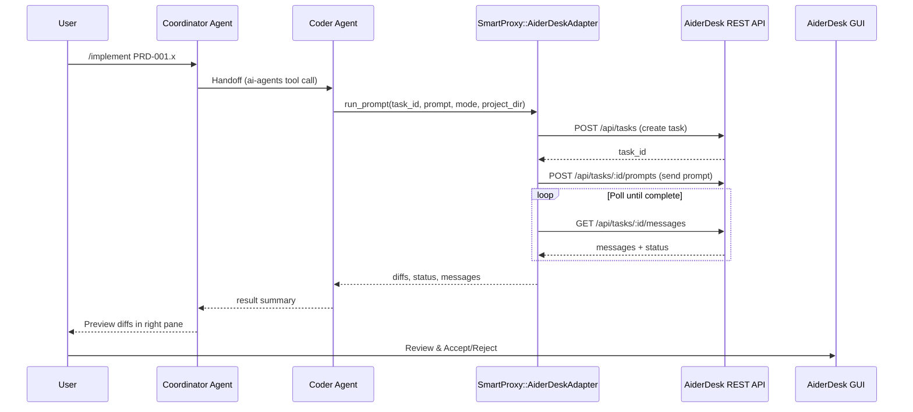

# Epic 001: Bootstrap Aider Integration as Coding Backend

**Epic ID:** 001-Aider-Bootstrap  
**Program:** Bootstrap Agent-Forge MVP  
**Last Updated:** 2026-02-08

---

**Epic Overview**  
Integrate Aider (via the AiderDesk REST API on port 24337) as the primary coding backend for the `Coder` agent role. This epic establishes the "muscle" of the Agent-Forge framework, enabling reliable, safe code generation and diff production. Success means a Coordinator agent can hand off a task to a Coder agent, who then uses AiderDesk to propose file changes that the human user can review and accept in the GUI. No auto-commits — preview-only mode by default.

**User Capabilities**
- Invoke Aider-powered code edits via the Agent-Forge chat/dashboard.
- Preview side-by-side diffs of proposed changes before they are committed.
- Verify changes in an isolated sandbox (`projects/aider-desk-test`).
- Seamlessly transition from high-level planning (Coordinator) to file-level implementation (Coder).

**Fit into Big Picture**  
This is the "Execution Foundation." Without a robust coding backend, Agent-Forge remains a planner. By bootstrapping AiderDesk integration, we enable the framework to begin implementing its own features (dogfooding). It follows the Phase 0 skeleton and precedes advanced RAG/streaming epics.

**Reference Documents**
- `knowledge_base/aider-desk/docs/aider-desk-py-docs.md`
- `knowledge_base/aider-desk/docs/rest-endpoints.md`
- `knowledge_base/aider-desk/docs/aider_desk_api_guide.md`
- `knowledge_base/ai-instructions/junie-log-requirement.md`

**Dependencies**
- Phase 0: Rails 8 skeleton, Project model, 4-pane layout, and basic chat infrastructure.
- Running AiderDesk instance (verified via curl health check).
- Ollama installed with models (qwen2.5-coder:32b-instruct as primary).

---

### Data Flow (Handoff Sequence)

---

### Key Decisions Locked In

**Architecture / Boundaries**
- **Thin Wrapper Pattern:** The Ruby client (`lib/aider_desk/client.rb`) remains a thin JSON-over-HTTP wrapper. Business logic for "coding" stays in Aider; orchestration logic stays in Rails.
- **Sandboxing:** All integration testing and initial implementation tasks MUST happen inside `projects/`. The root `agent-forge` repo is protected by default.
- **Polling over WebSockets:** Use HTTP polling for task status to minimize initial complexity (deferred: ActionCable/WebSockets).
- **Safety First:** `AiderDesk::Client` defaults to `preview_only: true`. No apply without explicit call. `FORCE_APPLY` constant (default `false`) available for testing only.

**UX / UI**
- **Dual-Pane Logic:** Chat/Logs on the left; Diffs/Preview on the right.
- **Human-in-the-Loop:** Every "Apply" action requires a manual click in the AiderDesk GUI or Agent-Forge dashboard.
- **Mobile:** N/A for MVP (desktop-first dashboard).

**Testing**
- **VCR/Webmock:** Mandatory for all AiderDesk API tests to ensure CI can run without a live AiderDesk instance.
- **Sandbox:** Use `projects/aider-desk-test` exclusively for integration tests.
- **Minitest** only (no RSpec).

**Observability**
- **Task Logging:** All AiderDesk interactions are logged to `Rails.logger` and the `Junie Task Log` of the active task.
- **Future:** Sentry integration deferred to later epic.

---

### High-Level Scope & Non-Goals

**In scope**
- Local AiderDesk setup verification and health checks.
- Autoloadable Ruby client (`lib/aider_desk/client.rb`) and CLI (`bin/aider_cli`).
- `SmartProxy::AiderDeskAdapter` integrating with `ai-agents` gem tool calling.
- Bootstrap of `projects/aider-desk-test` sandbox.
- End-to-end tests and documentation.

**Non-goals / deferred**
- Real-time streaming of token-by-token output (future epic).
- Automated PR creation (Epic 2).
- RAG/Long-memory context injection (Epic 3).
- Production deployment of AiderDesk or remote hosting.
- Auto-apply of code edits or commits.

---

### PRD Summary Table

| Priority | PRD Title | Scope | Dependencies | Suggested Branch | File |
|----------|-----------|-------|--------------|------------------|------|
| 01-01 | Local Setup & Verification | Port 24337, Ollama config, setup.md | None | `feat/aider-setup` | `PRD-1-01-local-setup-verification.md` |
| 01-02 | Ruby Client & CLI | `lib/aider_desk/client.rb`, credentials, `bin/aider_cli` | 01-01 | `feat/aider-client` | `PRD-1-02-ruby-client-cli.md` |
| 01-03 | SmartProxy Adapter & Tool Integration | `AiderDeskAdapter`, tool registration, handoff logic | 01-02 | `feat/aider-adapter` | `PRD-1-03-smartproxy-adapter.md` |
| 01-04 | Test Project Bootstrap | Bootstrap `projects/aider-desk-test` | None | `feat/aider-test-proj` | `PRD-1-04-test-project-bootstrap.md` |
| 01-05 | E2E Tests & Documentation | Full flow validation, integration.md, 90% coverage | 01-03, 01-04 | `feat/aider-e2e` | `PRD-1-05-e2e-tests-docs.md` |

---

### Key Guidance for All PRDs in This Epic

- **Architecture**: Always use the `AiderDeskAdapter` to wrap API calls. Never call the client directly from controllers or agents. Follow the Adapter pattern to allow swapping backends later.
- **Components**: ViewComponents for any dashboard/preview UI (deferred to later PRDs).
- **Data Access**: Ensure `project_dir` is always scoped to a folder inside `projects/` to prevent directory traversal.
- **Error Handling**: Gracefully handle `ConnectionRefused` and `Timeout`. Provide actionable advice (e.g., "Is AiderDesk running on port 24337?"). Raise `ApiError` on failure if `raise_on_error: true`.
- **Empty States**: N/A for MVP.
- **Accessibility**: N/A for MVP (CLI + API focus).
- **Mobile**: N/A for MVP (desktop-first).
- **Security**: Use `Rails.application.credentials` for AiderDesk Basic Auth. Never store credentials in plain text. Never auto-apply edits; always return diffs for UI preview and human confirmation.

---

### Success Metrics

- 100% pass rate for "Hello World" prompt → file creation in test project.
- API health check (200 OK on `/api/settings`) success rate of 100%.
- 90% Minitest coverage for `lib/aider_desk` and `SmartProxy` adapter code (measured with SimpleCov).
- Zero "unintentional" file changes in the root repo during tests.
- End-to-end task completion (prompt → file change) verified in test project.
- Documentation committed with curl examples and troubleshooting guide.

---

### Estimated Timeline

- PRD 01-01 to 01-05: 2 weeks total effort (1–2 days per PRD, with iterative review).
- **Target start:** 2026-02-10 (pending approval).
- Assign Claude for code generation/refinement, Grok for multi-faceted reasoning and PRD drafting, Ollama for local testing/validation.

---

### Risks

- AiderDesk API quirks or undocumented async behavior → Mitigation: fallback to pure Aider CLI wrapper; use polling with timeout.
- Ollama model performance on complex Rails tasks → Mitigation: default to qwen2.5-coder:32b-instruct; fallback to llama3.1:405b for deeper reasoning.
- Integration with ai-agents gem handoffs → Mitigation: use gem's tool calling schema; test with shared context injection.

---

### Implementation Status Tracking

- Status tracker: `0001-IMPLEMENTATION-STATUS.md`
- Update after each PRD completion.

---

### Testing Strategy

- See `TESTING-STRATEGY.md` in this directory for the full manual and automated testing plan.

---

### Baseline Gemfile

A baseline Gemfile for agent-forge (Rails 8.1+, Solid stack, ai-agents gem, HTTParty, VCR/Webmock) is documented in `knowledge_base/epics/epic-1-bootstrap/BASELINE-GEMFILE.md`. Key gems for this epic:
- `ai-agents` (~> 0.7.0) — multi-agent orchestration
- `httparty` — AiderDesk REST API calls
- `vcr` + `webmock` — test HTTP recording/stubbing
- `simplecov` — code coverage (≥ 90% target)
- `view_component` — modular UI components
- `devise` + `pundit` — auth/authorization

---

### Next Steps

1. Confirm epic overview (this file).
2. Review individual PRD files (listed in PRD Summary Table above).
3. Review `TESTING-STRATEGY.md`.
4. Create/confirm `0001-IMPLEMENTATION-STATUS.md`.
5. Proceed with PRD 01-01 (Local Setup & Verification).

---

### Detailed PRDs

Full PRD specifications live in separate files:
- `PRD-1-01-local-setup-verification.md`
- `PRD-1-02-ruby-client-cli.md`
- `PRD-1-03-smartproxy-adapter.md`
- `PRD-1-04-test-project-bootstrap.md`
- `PRD-1-05-e2e-tests-docs.md`
